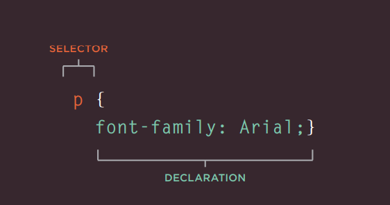
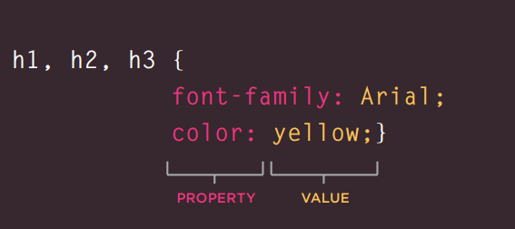
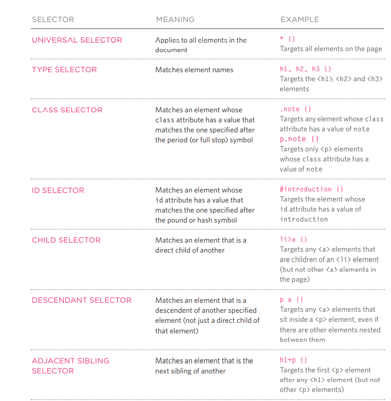
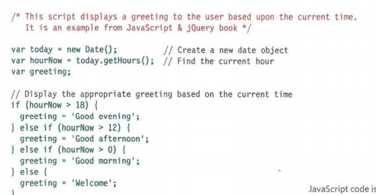
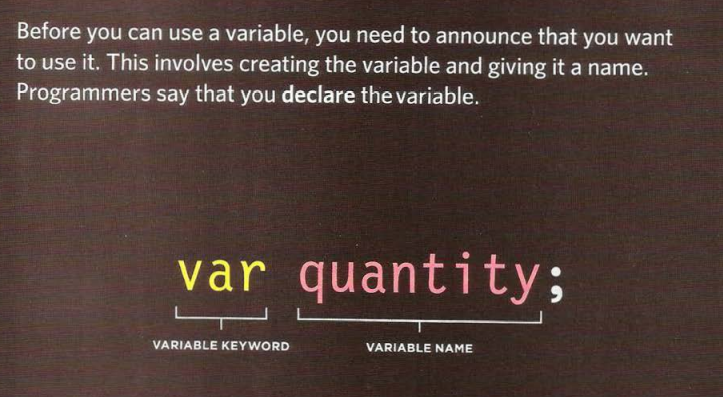
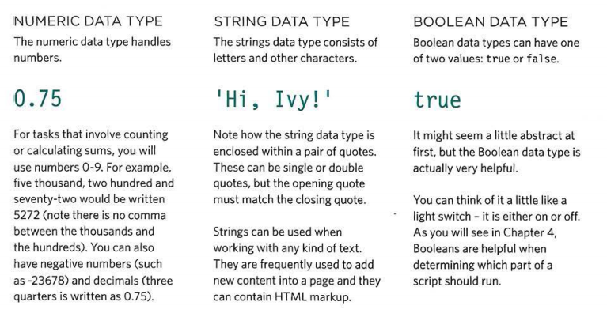
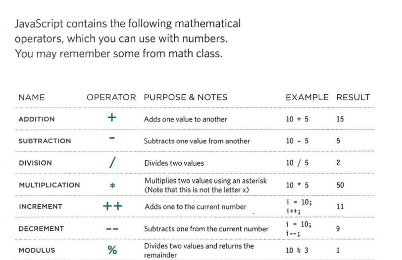
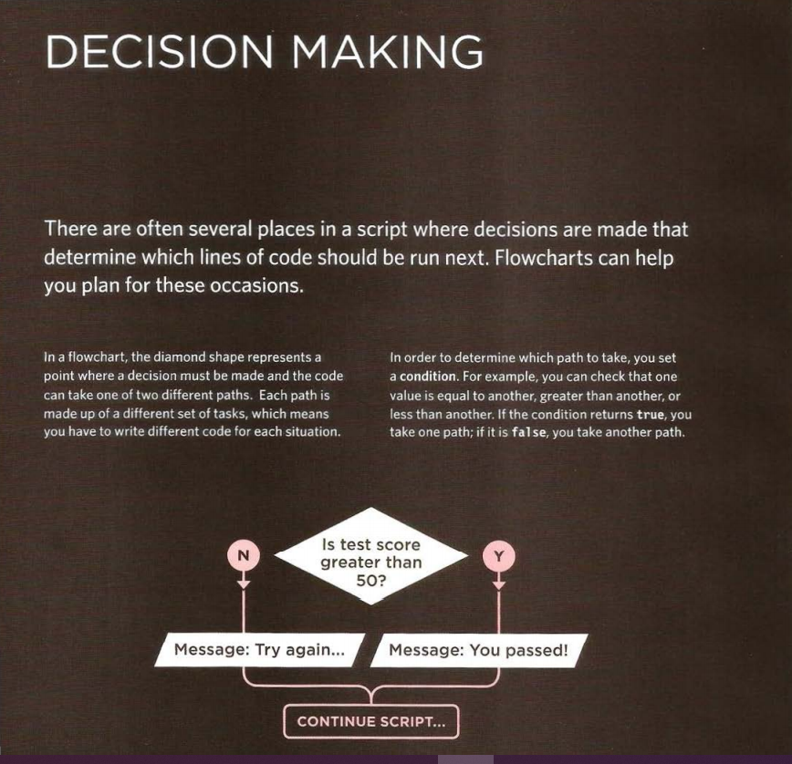

# Basics of HTML, CSS & JS

## HTML

### Headings
* < h1>
* < h2>
* < h3>
* < h4>
* < h5>
* < h6>

HTML has six "levels" of headings:

1. < h1> is used for main headings

2. < h2> is used for subheadings

If there are further sections under the subheadings then the 
 < h3> element is used, and so on...
 Browsers display the contents of headings at different sizes.

The contents of an < h1> element is the largest, and the contents of an <h6> element is the smallest. 

The exact size at which each browser shows the headings can vary slightly. 
Users can also adjust the size of text in their 
browser. 

### Paragraph
< p >

To create a paragraph, surround the words that make up the paragraph with an opening < p> tag and closing < /p> tag

### Bold & Italic

< b>

By enclosing words in the tags < b> and < /b> we can make characters appear bold.
The < b> element also represents a section of text that would be presented in a visually different way (for example key words in a  paragraph) although the use of the < b> element does not imply any additional meaning

< i>
By enclosing words in the tags < i> and < /i> we can make characters appear italic.The < i> element also represents a section of text that would be said in a different way from surrounding content — such as 
technical terms, names of ships, foreign words, thoughts, or other 
terms that would usually be italicized

### Superscript & Subscript

< sup>

The < sup> element is used to contain characters that should be superscript such as the suffixes of dates or mathematical concepts like raising a number to a power such as 2^2

< sub>

The  element is used to contain characters that should be subscript. It is commonly used with foot notes or chemical formulas such as H20

### White Space

In order to make code easier to read, web page authors often add extra spaces or start some elements on new lines.

When the browser comes across two or more spaces next to each other, it only displays one space. Similarly if it comes across a line break, it treats that as a single space too. This is known as white space collapsing

### Line Breaks & Horizontal Rules

 

As you have already seen, the browser will automatically show each new paragraph or heading on a new line. But if you wanted to add a line break inside the middle of a paragraph you can use the line break tag  .

To create a break between themes — such as a change of topic in a book or a new scene in a play — you can add a horizontal rule between sections using the 
 tag

### Strong & Emphasis

<strong >

The use of the < strong> element indicates that its content has strong importance. 

< em>

The < em> element indicates emphasis that subtly changes the meaning of a sentence

### Quotation

There are two elements commonly used for marking up quotations:

< blockquote>

The <blockquote > element is used for longer quotes that take up an entire paragraph. Note how the 
 element is still used inside the <blockquote >element. 

Browsers tend to indent the contents of the <blockquote> element however you should not use this element just to indent a piece of text — rather you should achieve this effect using CSS. 

< q>

The <q > element is used for shorter quotes that sit within a paragraph. Browsers are supposed to put quotes around the <q> element, however Internet Explorer does not — therefore many people avoid 
using the < q> elemen

### Abbreviations & Acronyms

< abbr> chapter-02/abbreviations.html HTMLIf you use an abbreviation or an acronym, then the <abbr> element can be used. A title attribute on the opening tag is used to specify the full term

### Citations & Definitions

< cite>

When you are referencing a piece of work such as a book, film or research paper, the < cite> element can be used to indicate where the citation is from. In HTML5, <cite> should not really be used for a person's name — but it was allowed in HTML 4, so most people are likely to continue to use it.

< dfn>

The first time you explain some new terminology (perhaps an academic concept or some jargon) in a document, it is known as the defining instance of it.The <dfn> element is used to indicate the defining instance of a new term.

### Author Details

 
The < address> element has quite a specific use: to contain contact details for the author of the page.It can contain a physical address, 
but it does not have to. For example, it may also contain a phone number or email address

## CSS Associates Style rules with HTML elements

CSS works by associating rules with HTML elements. These rules govern 
how the content of specified elements should be displayed. A CSS rule 
contains two parts: a selector and a declaration.

### CSS Properties Affect How Elements Are Displayed

CSS declarations sit inside curly brackets and each is made up of two 
parts: a property and a value, separated by a colon. You can specify 
several properties in one declaration, each separated by a semi-colon.

### Using External CSS

< link> chapter-10/using-external-css.html HTMLThe < link> element can be used in an HTML document to tell the browser where to find the CSS file used to style the page. It is an empty element (meaning it does not need a closing tag), and it lives inside the <head> element. 
It should use three attributes:

href

This specifies the path to the CSS file (which is often placed in a folder called css or styles).

type

This attribute specifies the type of document being linked to. The value should be text/css.

rel

 This specifies the relationship 
between the HTML page and the file it is linked to. The value should be stylesheet when linking to a CSS file

### Using Internal CSS

< style>
You can also include CSS rules within an HTML page by placing 
them inside a <style> element, which usually sits inside the < head> element of the page. The <style> element should use the type attribute to indicate that the styles are specified in CSS. The value should be text/css

### CSS Selectors

## Basic JavaScript Instructions
A script is a series of instructions that a computer can follow one-by-one. Each individual instruction or step is known as a statement. Statements should end with a semicolon

### COMMENTS 

You should write comments to explain what your code does. They help make your code easier to read and understand. This can help you and others who read your code.

### WHAT IS A VARIABLE?

A script will have to temporarily store the bits of information it 
needs to do its job. It can store this data in variables. 

### DATA TYPES

### ARITHMETI C OPERATORS

### Decisions and Loops

