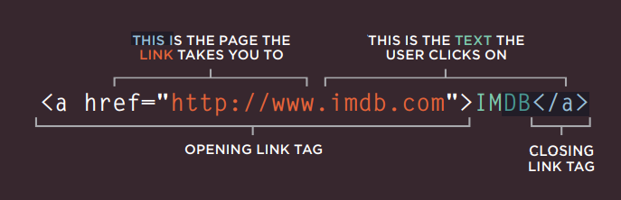
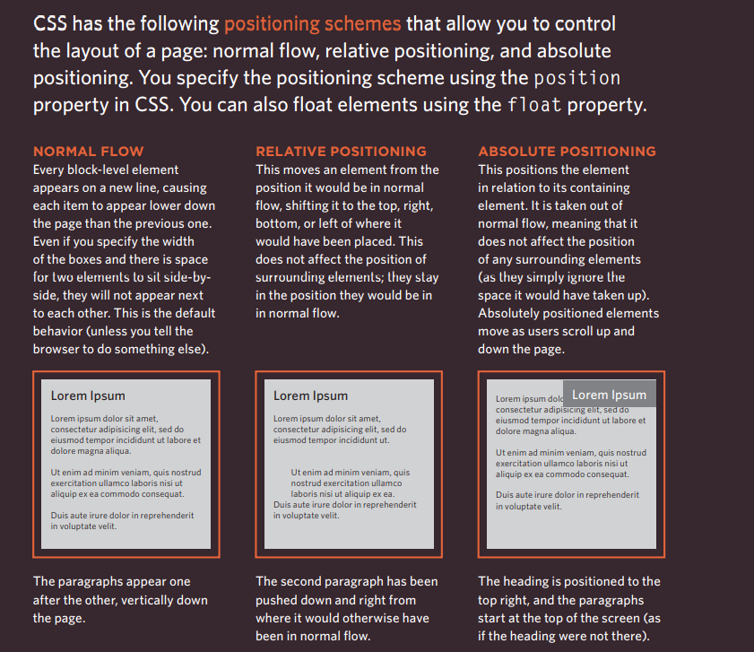
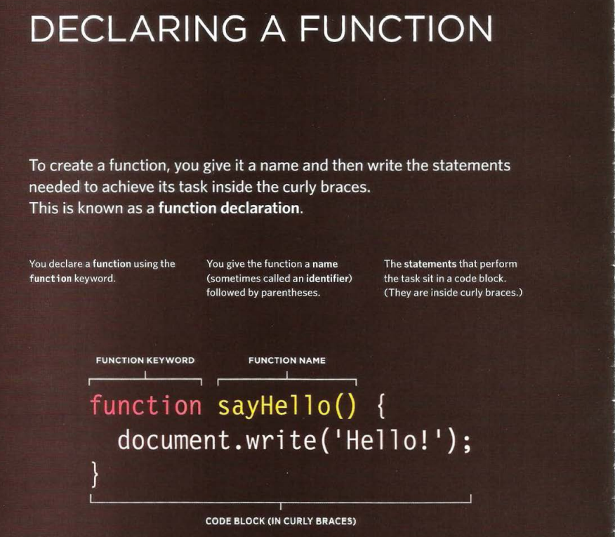
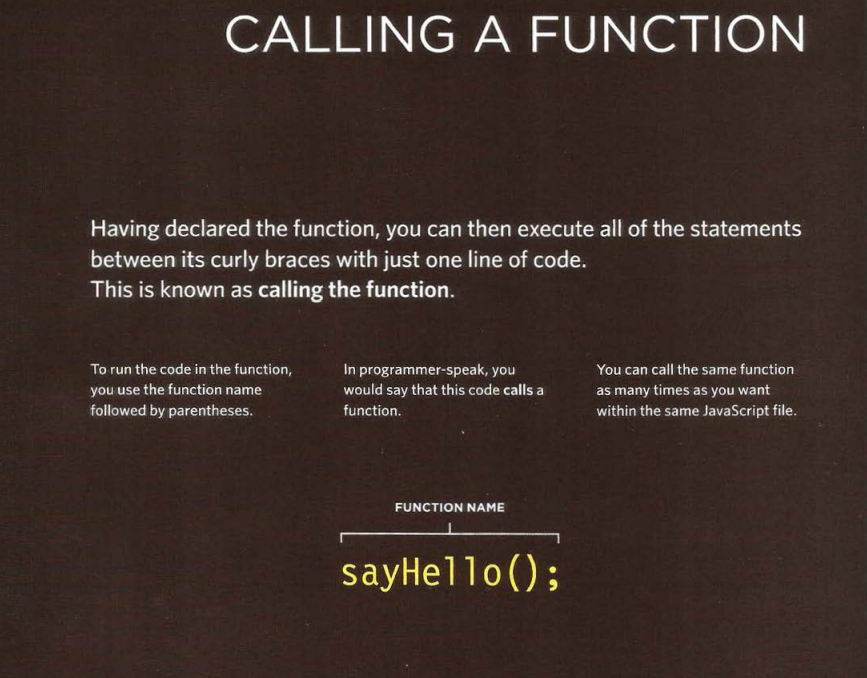
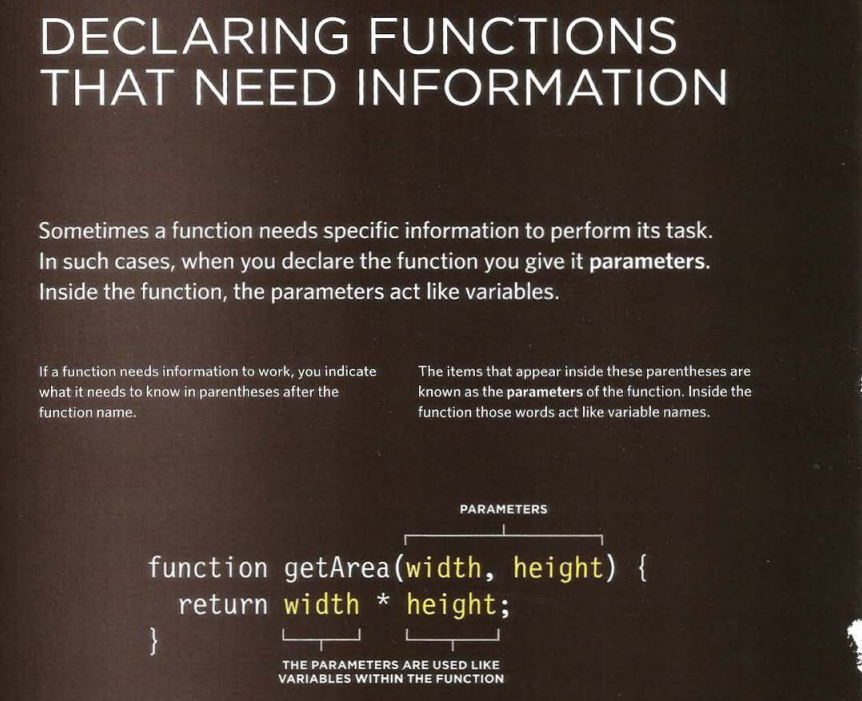
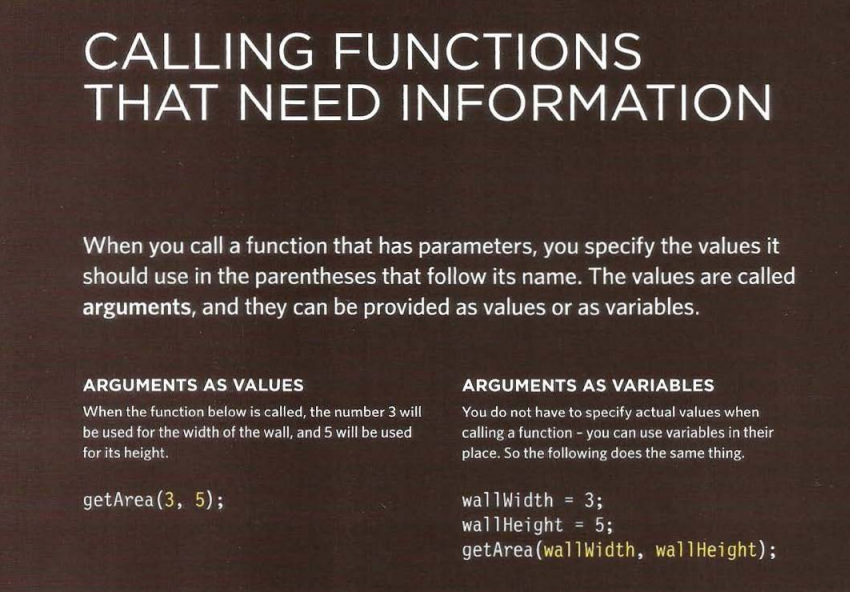
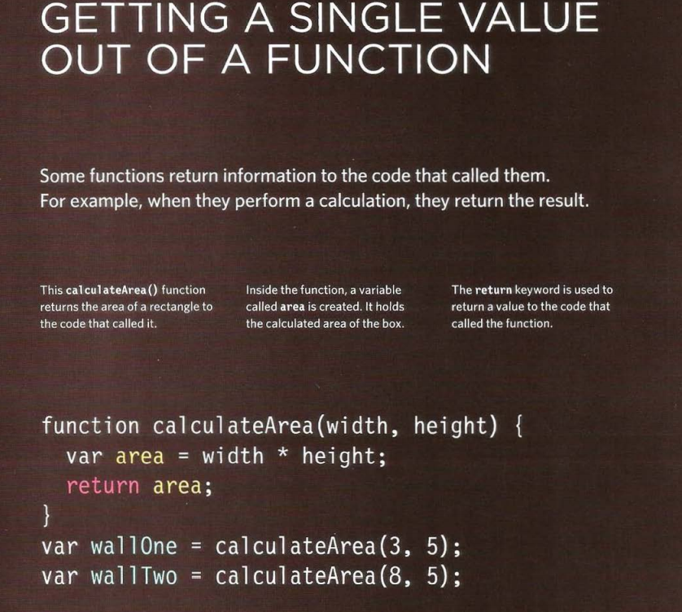
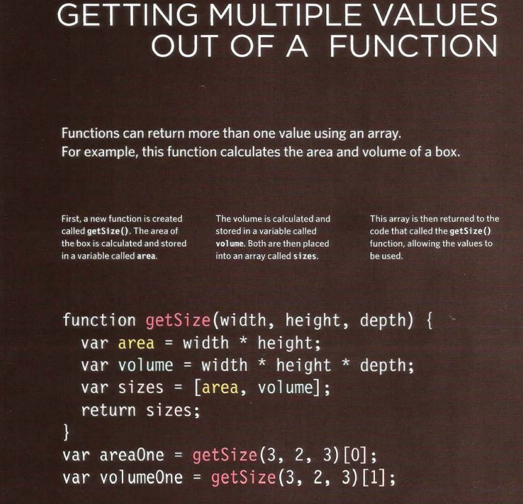

# HTML Links, JS Functions, and Intro to CSS Layout

### Writing Links

Links are created using the < a> element Users can click on anything between the opening < a> tag and the closing < /a> tag. You specify 
which page you want to link to using the href attribute.

### Linking to Other Pages on the Same Site   

 #### < a>
When you are linking to other pages within the same site, you do not need to specify the domain name in the URL. You can use a shorthand known as a relative URL

### Layout

#### Building Blocks

 CSS treats each HTML element as if it is in its own box. This box will either be a block-level
box or an inline box.Block-level boxes start on a new line and act as the main building blocks of any layout, while inline boxes flow between surrounding text. 
You can control how much space each box takes up by setting the width of the boxes (and sometimes the height, too). To separate boxes, you can use borders, margins, padding, and background colors.

#### Block-level elements
start on a new line Examples include:

* < h1>
* < p> 
* < ul> 
* < li>

### Inline elements

flow in between surrounding text Examples include:

* < img> 
* < b>
* < i>

### Controlling the Position of Elements

### Normal Flow

#### position:static

In normal flow, each block-level element sits on top of the next one. Since this is the default 
way in which browsers treat HTML elements, you do not need a CSS property to indicate that elements should appear 
in normal flow, but the syntax would be:

position: static;

### Absolute Positioning

#### position:absolute

When the position property is given a value of absolute, the box is taken out of normal 
flow and no longer affects the position of other elements on the page. (They act like it is not 
there.) The box offset properties (topor bottom and left or right) specify where the element 
should appear in relation to its containing element.

### Fixed Positioning

#### position:fixed

Fixed positioning is a type of absolute positioning that requires the position property to have a value of fixed.
It positions the element in relation to the browser window. Therefore, when a user scrolls 
down the page, it stays in the exact same place. It is a good idea to try this example in your browser to see the effect.

To control where the fixed position box appears in relation to the browser window, the box offset properties are used.

### Floating Elements

#### float
The float property allows you to take an element in normal flow and place it as far to the 
left or right of the containing element as possible.Anything else that sits inside 
the containing element will flow around the element that is 
floated.When you use the floatproperty, you should also use the width property to indicate how 
wide the floated element should be. If you do not, results can be inconsistent but the box is likely 
to take up the full width of the containing element (just like it would in normal flow)

### Clearing Floats

 #### clear

 the clear property allows you to say that no element (within the same containing element) 
should touch the left or righthand sides of a box. It can take the following values:left
The left-hand side of the box should not touch any other elements appearing in the same containing element.

#### right

The right-hand side of the box will not touch elements appearing in the same containing element.

#### both

Neither the left nor right-hand sides of the box will touch elements appearing in the same 
containing element.

#### none

Elements can touch either side.

## Functions, Methods, and Objects

### A BASIC FUNCTION

In this example, the user is shown a message at the top of the page. The message is held 
in an HTML element whose id attribute has a value of message. The message is going to be 
changed using JavaScript
Before the closing < /body> tag, you can see the link to the JavaScript file. The JavaScript 
file starts with a variable used to hold a new message, and is followed by a function called 
updateMessage().

### 6 Reasons for Pair Programming

#### How does pair programming work?

While there are many different styles, pair programming commonly involves two roles: the Driver and the Navigator. The Driver is the programmer who is typing and the only one whose hands are on the keyboard. Handling the “mechanics” of coding, the Driver manages the text editor, switching files, version control, and—of course writing—code. The Navigator uses their words to guide the Driver but does not provide any direct input to the computer. The Navigator thinks about the big picture, what comes next, how an algorithm might be converted in to code, while scanning for typos or bugs. The Navigator might also utilize their computer as a second screen to look up solutions and documentation, but should not be writing any code.

### Why pair program?
Pair programming touches on all four skills: developers explain out loud what the code should do, listen to others’ guidance, read code that others have written, and write code themselves.

1. Greater efficiency

It is a common misconception that pair programming takes a lot longer and is less efficient. In reality, when two people focus on the same code base, it is easier to catch mistakes in the making. Research indicates that pair programing takes slightly longer, but produces higher-quality code that doesn’t require later effort in troubleshooting and debugging (let alone exposing users to a broken product). So, in the long-run, it’s often actually more efficient than two people working on separate features. When coming up with ideas and discussing solutions out loud, two programmers may come to a solution faster than one programmer on their own. Also, when the pair is stuck, both programmers can research the problem and reach a solution faster. Researches also identified pairing enhances technical skills, team communication, and even enjoyability of coding in the workplace.

2. Engaged collaboration

When two programmers focus on the same code, the experience is more engaging and both programmers are more focused than if they were working alone. It is harder to procrastinate or get off track when someone else is relying on you to complete the work. Popping open your Facebook timeline is just that less enticing when someone else is looking at your screen.

3. Learning from fellow students

Everyone has a different approach to problem solving; working with a teammate can expose developers to techniques they otherwise would not have thought of. If one developer has a unique approach to a specific problem, pair programming exposes the other developer to a new solution

4. Social skills

Pair programming is great for improving social skills. When working with someone who has a different coding style, communication is key. This can become more difficult when two programmers have different personalities. Pair programming not only improves programming skills, but can also help programmers develop their interpersonal skills. When just grabbing the keyboard and taking over isn’t an option, getting good at finding the right words is a skill unto itself

5. Job interview readiness

A common step in many interview processes involves pair programming between a current employee and an applicant, either in person or through a shared screen. They will carry out exercises together, such as code challenges, building a project or feature, or debugging an existing code base. By doing so, companies can get a better feel for how an applicant will fit into the team and their collaboration style.

6. Work environment readiness

Many companies that utilize pair programing expect to train fresh hires from CS-degree programs on how they operate to actually deliver a product. Code Fellows graduates who are already familiar with how pairing works can hit the ground running at a new job, with one less hurdle to overcome.
