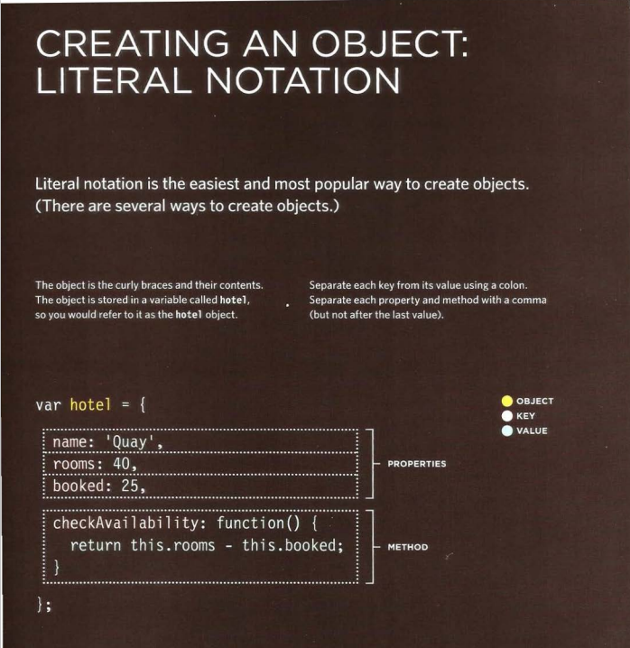
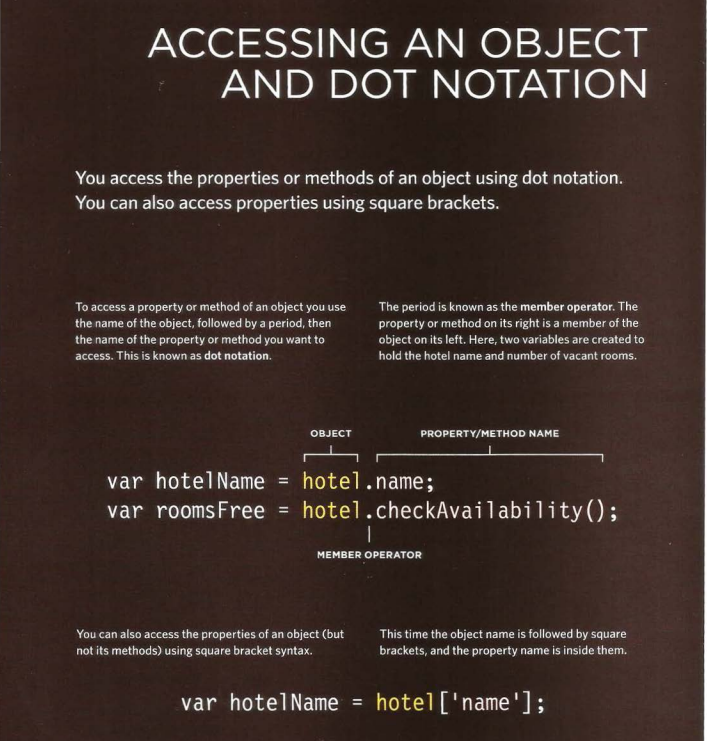
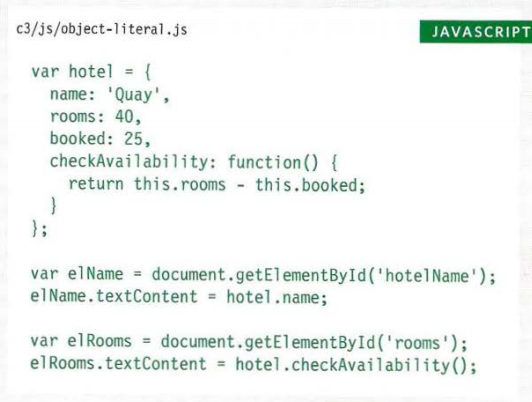
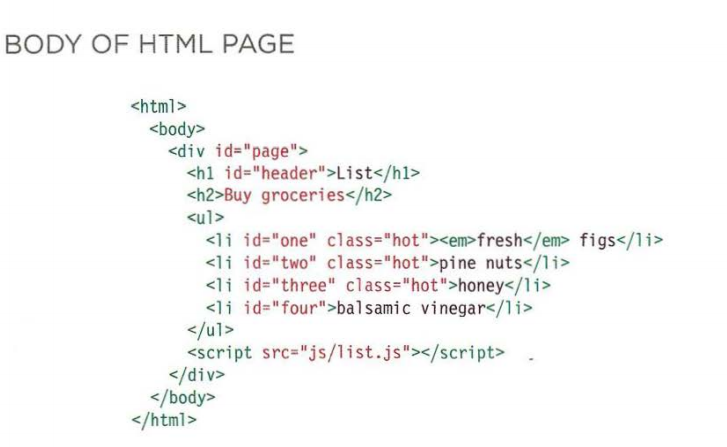
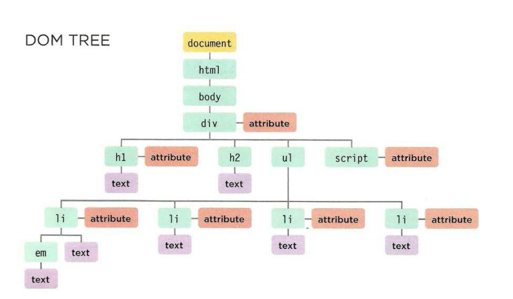
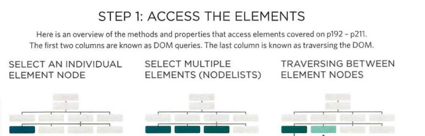
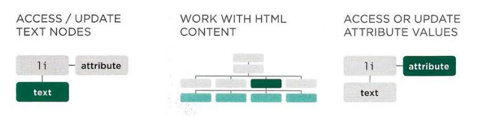

# Problem Domain, Objects, and the DOM

## WHAT IS AN OBJECT?

Objects group together a set of variables and functions to create a model of a something you would recognize from the real world. In an object, 
variables and functions take on new names.

### CREATING· OBJECTS USING LITERAL NOTATION 

This example starts by creating an object using literal notation. This object is called hotel which 
represents a hotel called Quay with 40 rooms (25 of which have been booked). 
Next, the content of the page is updated with data from this object. It shows the name of the 
hotel by accessing the object's name property and the number of vacant rooms using the 
checkAvail ability() method. To access a property of this object, the object name is followed by a dot (the period 
symbol) and the name of the property that you want. Similarly, to use the method, you can use the object name followed by the method name. 
hotel . checkAvailability() 

## Document Object Model

### THE DOM TREE IS A MODEL OF A WEB PAGE

As a browser loads a web page, it creates a model of that page. The model is called a DOM tree, and it is stored in the browsers' memory. 
It consists of four main types of nodes.

Each node is an object with methods and properties. Scripts access and update this DOM tree (not the source HTML file). 
Any changes made to the DOM tree are reflected in the browser. 

### WORKING WITH THE DOM TREE

Accessing and updating the DOM tree involves two steps: 

1.  Locate the node that represents the element you want to work with. 
2.  Use its text content, child elements, and attributes.

#### STEP 1: ACCESS THE ELEMENTS

The terms elements and element nodes are used interchangeably but when people say the DOM is working with an element, 
it is actually working with a node that represents that element.

#### STEP 2: WORK W ITH THOSE ELEMENTS 

### TRAVERSING THE DOM
When you have an element node, you can select another element in relation to it using these five 
properties. This is known as traversing the DOM. 
 
 * parentNode
 This property finds the element node for the containing (or parent) element in the HTML. 

(1) If you started with the first < l i >element, then its parent node would be the one 
representing the < ul >element

* previousSibling nextSibling 

These properties find the previous or next sibling of a node if there are siblings. 
If you started with the first <1 i > element, it would not have a previous sibling. However, its next sibling (2) would be the node 
representing the second < l i >. 

* f i rstChil d lastChild 

These properties find the first or last child of the current element. 

If you started with the < u 1 > element, the first child would be the node representing the first 
< l i> element, and (3) the last child would be the last <1 i >. 

## ADDING ELEMENTS USING DOM MANIPULATION

DOM manipulation offers another technique to add new content to a page (rather than i nnerHTML). It involves three steps: 

1. createEl ement () 

You start by creating a new element node using the createElement() method. 
This element node is stored in a variable

2. createTextNode() 
createTextNode() creates a  new text node. Again, the node is stored in a variable. It can be in a text node), you can add added to the element node using it to the DOM tree using the the appendChi l d () method

3. appendChild() 
Now that you have your element 
new text node. Again, the node (optionally with some content 
 It can be in a text node), you can add it to the DOM tree using the appendChi l d () method. 

 ### REMOVING ELEMENTS VIA DOM MANIPULATION 
 1. STORE THE ELEMENT TO BE REMOVED IN A VARIABLE
 2. STORE THE PARENT OF THAT ELEMENT IN A VARIABLE
 3. REMOVE THE ELEMENT FROM ITS CONTA INING ELEMENT 
 