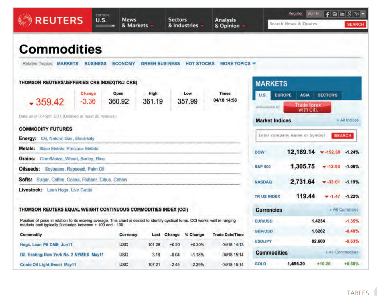
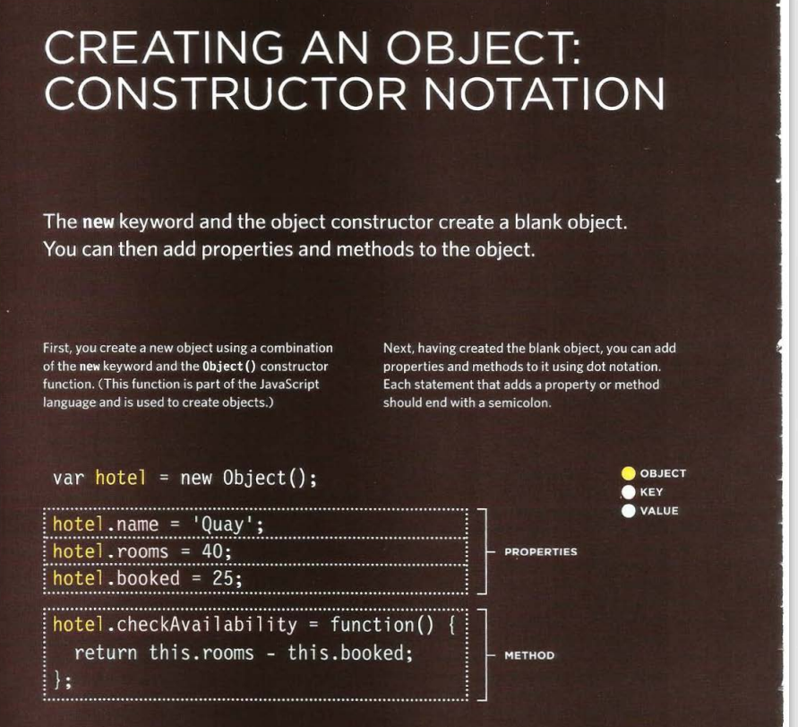
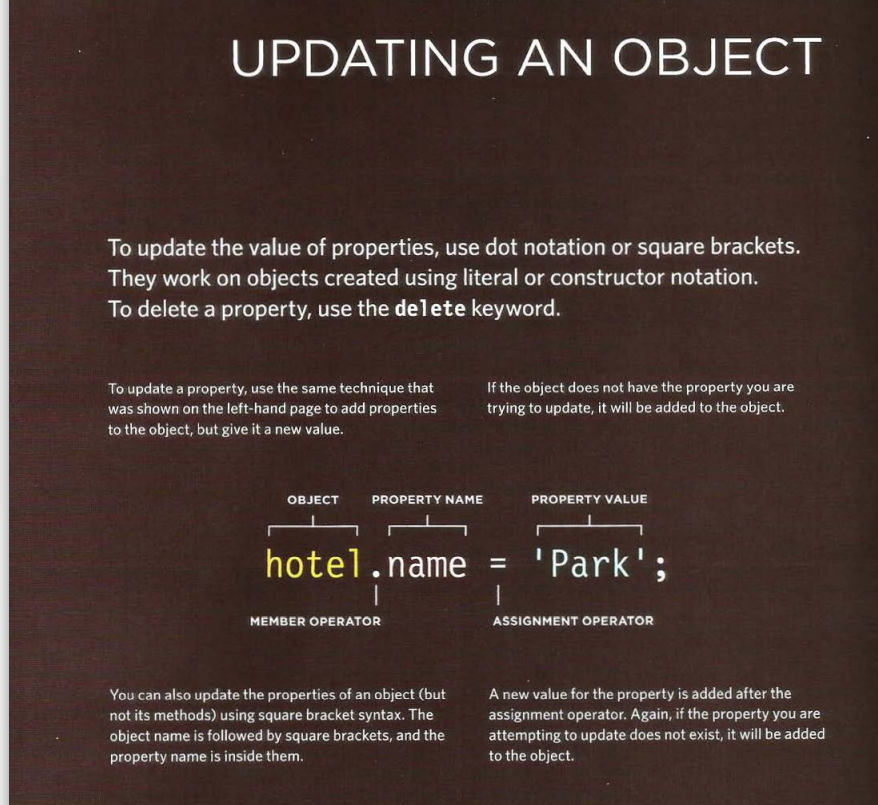

# Object-Oriented Programming, HTML Tables

## Tables
A table represents information in a grid format. Examples of tables include financial reports, TV 
schedules, and sports results.

### Basic Table Structure

* <table>
The <table> element is used to create a table. The contents of the table are written out row 
by row.

* <tr>
You indicate the start of each row using the opening <tr> tag. (The tr stands for table row.) 
It is followed by one or more <td> elements (one for each cell in that row)

* <td>
Each cell of a table is represented using a <td>element. (The td stands for 
table data.)At the end of each cell you use a closing </td> tag.

### Table Headings

 * <th>
The <th> element is used just like the <td> element but its 
purpose is to represent the heading for either a column or a row. (The th stands for table 
heading.)

Even if a cell has no content, you should still use a <td> or <th> element to represent 
the presence of an empty cell otherwise the table will not render correctly. (The first cell 
in the first row of this example shows an empty cell.)

### Spanning ColumnS

Sometimes you may need the entries in a table to stretch across more than one column.
The colspan attribute can be used on a <th> or <td> element and indicates how many columns 
that cell should run across.In the example on the right you can see a timetable with 
five columns; the first column contains the heading for that row (the day), the remaining four 
represent one hour time slots.

### Spanning Rows
You may also need entries in a table to stretch down across more than one row.
The rowspan attribute can be used on a <th> or <td> element to indicate how many rows a cell 
should span down the table.In the example on the left you can see that ABC is showing a 
movie from 6pm - 8pm, whereas the BBC and CNN channels are both showing two programs 
during this time period (each of which lasts one hour).

### Long Tables

There are three elements that help distinguish between the main content of the table and 
the first and last rows (which can contain different content).These elements help people 
who use screen readers and also allow you to style these sections in a different manner than the 
rest of the table (as you will see when you learn about CSS).

* <thead>
The headings of the table should 
sit inside the <thead> element. 

* <tbody>
The body should sit inside the 
<tbody> element. 

* <tfoot>
The footer belongs inside the 
<tfoot> element.

### CREATING OBJECTS USING CONSTRUCTOR SYNTAX

On the right, an empty object called hote 1 is created using the constructor function. 
Once it has been created, three properties and a method are then assigned to the object. 
(If the object already had any of these properties, this would overwrite the values in those 
properties.) To access a property of this object, you can use dot notation, 
just as you can with any object. 

### CREATE & ACCESS OBJECTS CONSTRUCTOR NOTATION

To get a better idea of why you might want to create multiple objects on the same page, here 
is an example that shows room availability in two hotels. First, a constructor function 
defines a template for the hotels. Next, two different instances of this type of hotel object are 
created. The first represents a hotel called Quay and the second a hotel called Park. 
Having created instances of these objects, you can then access their properties and 
methods using the same dot notation that you use with all other objects.

