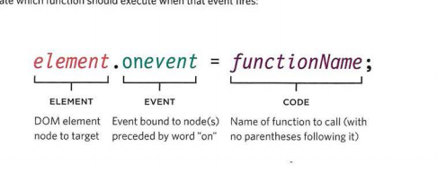

# Forms and JS Events

The best known form on the web is probably the search box that sits right in the middle of 
Google's homepage.

### Form Controls

There are several types of form controls that you can use to collect information from visitors 
to your site.

* ADDING TEXT:
* Making Choices:
* Submitting Forms: 
* Uploading Files:

### Form Structure

#### <form>

Form controls live inside a <form> element. This element should always carry the action
attribute and will usually have a method and id attribute too

#### action

Every <form> element requires an action attribute. Its valueis the URL for the page on the 
server that will receive the information in the form when it is submitted.

#### method

Forms can be sent using one of two methods: get or post.With the get method, the values 
from the form are added to the end of the URL specified in the action attribute. 

## Lists, Tables and Forms

### Bullet Point Styles

#### list-style-type

The list-style-type property allows you to control the shape or style of a bullet point (also 
known as a marker). It can be used on rules that apply to the <ol>, <ul>, and <li>elements

### Images for Bullets

 #### list-style-image

 You can specify an image to act as a bullet point using thelist-style-image property.
The value starts with the letters url and is followed by a pair of parentheses. Inside the 
parentheses, the path to the image is given inside double quotes.
This property can be used on rules that apply to the <ul> and <li> element

### Positioning the Marker

#### list-style-position
Lists are indented into the page by default and the list-styleposition property indicates 
whether the marker should appear on the inside or the outside of the box containing the 
main points

### List Shorthand

#### list-style
As with several of the other CSS properties, there is a property that acts as a shorthand for list 
styles. It is called list-style, and it allows you to express the markers' style, image and 
position properties in any order

### DIFFERENT EVENT TYPES 

### THREE WAYS TO BIND AN EVENT TO AN ELEM ENT

1. HTML EVENT HANDLERS
2. TRADITIONAL DOM EVENT HANDLERS 
3. DOM LEVEL 2 EVENT LISTENERS 

### TRADITIONAL DOM EVENT HANDLERS

