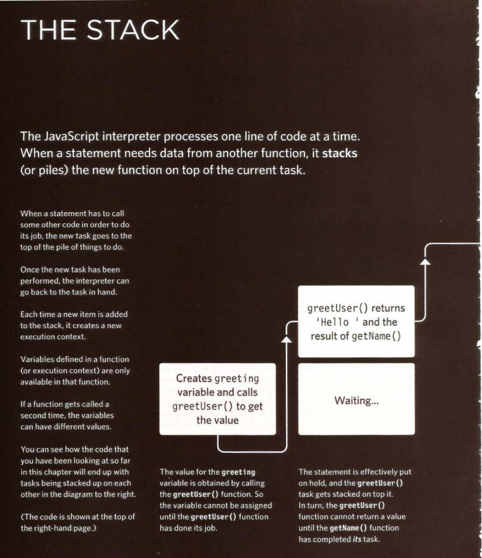
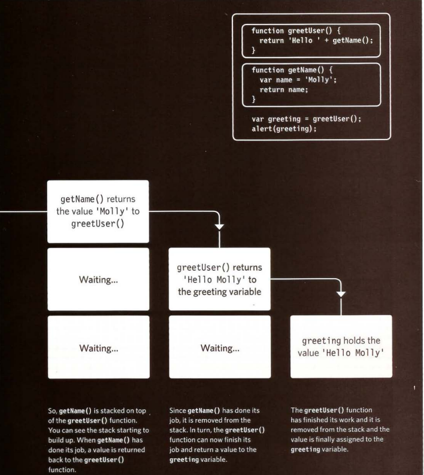

## Error Handling & Debugging

### ORDER OF EXECUTION
To find the source of an error, it helps to know how scripts are processed. The order in which statements are executed can be complex; some tasks 
cannot complete until another statement or function has been run: 

### EXECUT.ION CONTEXTS
The JavaScript interpreter uses the concept of execution contexts. There is one global execution context; plus, each function creates a new 
new execution context. They correspond to variable scope. 

### EXECUTION CONTEXT & HOISTING 
Each time a script enters a new execution context, there are two phases 
of activity: 

1. PREPARE 
2. EXECUTE

### UNDERSTANDING SCOPE

In the interpreter, each execution context has its own va ri ables object. It holds the variables, functions, and parameters available within it. 
Each execution context can also access its parent's v a ri ables object. 

### UNDERSTANDING ERRORS

If a JavaScript statement generates an error, then it throws an exception. At that point, the interpreter stops and looks for exception-handl ing code.

### ERROR OBJECTS
Error objects can help you find where your mistakes are and browsers have tools to help you read them. 

### HOW TO DEAL WITH ERRORS
Now that you know what an error is and how the browser treats them, there are two things you can do with the errors. 

1. DEBUG THE SCRIPT TO FIX ERRORS

If you come across an error while writing a script (or when someone reports a bug), you will need to 
debug the code, track down the source of the error, and fix it. 

2. HANDLE ERRORS GRACEFULLY

You can handle errors gracefully using try, catch, throw, and f i na 1 ly statements. 
Sometimes, an error may occur in the script for a reason beyond your control. For example, you might 
request data from a third party, and their server may not respond. In such cases, it is particularly 
important to write error-handling code. 

### BROWSER DEV TOOLS & JAVASCRIPT CONSOLE

The JavaScript console will tell you when there is a problem with a script, where to look for the problem, and what kind of issue it seems to be.

These two pages show instructions for opening the console in all of the main browsers (but the rest of 
this chapter will focus on Chrome and Firefox). 

CHROM E/ OPERA