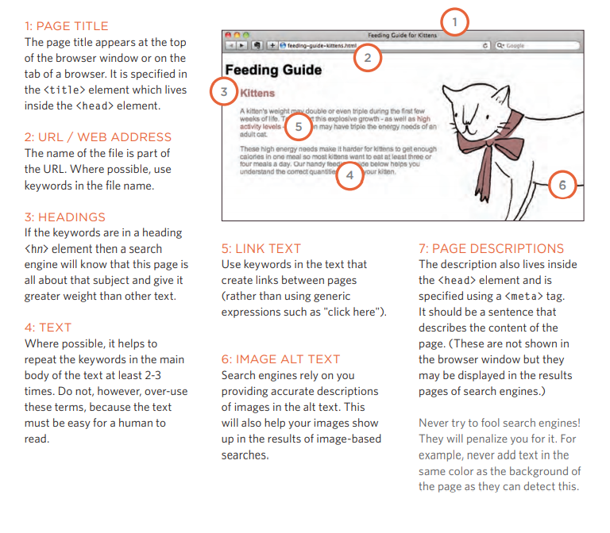

# Audio, Video, Images

### Controlling sizes of images in CSS
You can control the size of an image using the width and height properties in CSS, just 
like you can for any other box. Specifying image sizes helps pages to load more smoothly 
because the HTML and CSS code will often load before the images, and telling the browser 
how much space to leave for an image allows it to render the rest of the page without waiting for 
the image to download.You might think that your site is likely to have images of all 
different sizes, but a lot of sites use the same sized image across many of their pages. 

### AligNing images Using CSS
n the last chapter, you saw how the float property can be used to move an element to the left or 
the right of its containing block, allowing text to flow around it.Rather than using the 
element's align attribute, web page authors are increasingly using the float property to align 
images. There are two ways that this is commonly achieved:1: The float property is added 
to the class that was created to represent the size of the image 

### Centering images Using CSS
By default, images are inline elements. This means that they flow within the surrounding text. 
In order to center an image, it should be turned into a blocklevel element using the display
property with a value of block. Once it has been made into a block-level element, there are 
two common ways in which you can horizontally center an image:

1.  On the containing element, you can use the text-alignproperty with a value of center.

2.  On the image itself, you can use the use the margin property and set the values of the left and 
right margins to auto

### Background Images

#### background-image

The background-image property allows you to place an image behind any HTML 
element. This could be the entirepage or just part of the page. By 
default, a background image will repeat to fill the entire box.
The path to the image follows the letters url, and it is put 
inside parentheses and quotes.

### Repeating Images
#### background-repeat
#### background-attachment

The background-repeatproperty can have four values:

* repeat
The background image is repeated both horizontally and vertically (the default way it 
is shown if the backgroundrepeat property isn't used).

* repeat-x
The image is repeated horizontally only (as shown in the first example on the left).

* repeat-y
The image is repeated vertically 
only.
* no-repeat
The image is only shown once.The background-attachment property specifies whether a 
background image should stay in one position or move as the user scrolls up and down the page. It 
can have one of two values:

* fixed
The background image stays in 
the same position on the page.
* scroll
The background image moves 
up and down as the user scrolls 
up and down the page.

### Background Position
#### background-position
When an image is not being repeated, you can use the background-position
property to specify where in the browser window the background image should be placed. 

This property usually has a pair of values. The first represents the horizontal position and the 
second represents the vertical.

### shorthand
#### background
The background property acts like a shorthand for all of the other background properties 
you have just seen, and also the background-color property.The properties must be specified 
in the following order, but you can miss any value if you do not want to specify it.
1. background-color
2. background-image
3. background-repeat
4. background-attachment
5. background-position

## Practical Information

### Search Engine Optimization (SEO)

SEO is a huge topic and several books have been written on the subject. The following pages will help you understand the key concepts so you can improve your website's visibility on search engines.

### On-Page SEO
 In every page of your website there are seven key places where keywords (the words people might search on to find your site) can appear in order 
to improve its findability

### How to Identify Keywords and Phrases

Determining which keywords to use on your site can be one of the hardest tasks when you start to think about SEO. Here are six steps that 
will help you identify the right keywords and phrases for your site.

1. Brainstorm
2. Organize
3. Research
4. Compare
5. Refine
6. Map

### How Many People Are Coming to Your Site?
The overview page gives you a snapshot of the key information you are likely to want to know. In particular, it tells you how many people are 
coming to your site.

#### Visits
This is the number of times people have come to your site. If someone is inactive on your site 
for 30 minutes and then looks at another page on your site, it will be counted as a new visit.

#### Unique Visits
This is the total number of people who have visited your site over the specified period. The 
number of unique visits will be lower than the number of visits if people have been returning to 
your site more than once in the defined period.

#### Page Views
The total number of pages all visitors have viewed on your site

#### Pages per Visit
The average number of pages each visitor has looked at on your site per visit

