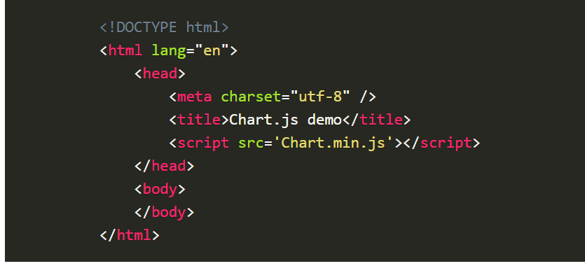
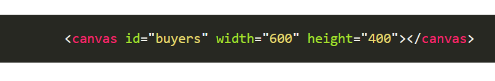
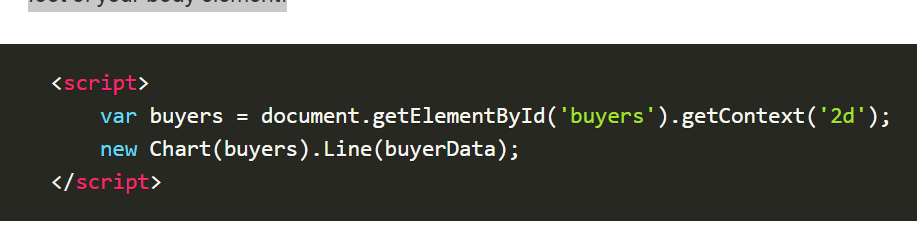
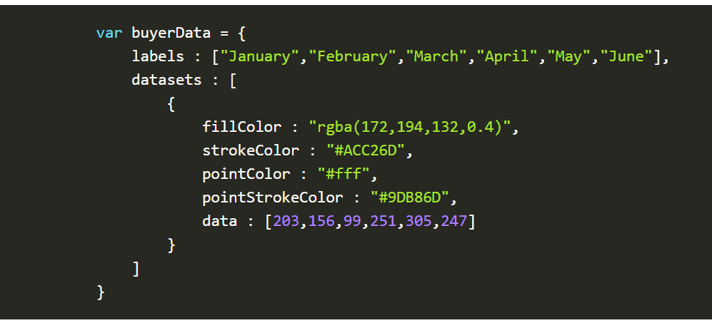
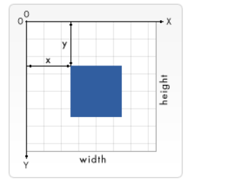

# Chart.js, Canvas
## chart
Charts are far better for displaying data visually than tables and have the added benefit that no one is ever going to press-gang them into use as a layout tool. They’re easier to look at and convey data quickly, but they’re not always easy to create.
A great way to get started with charts is with Chart.js, a JavaScript plugin that uses HTML5’s canvas element to draw the graph onto the page. It’s a well documented plugin that makes using all kinds of bar charts, line charts, pie charts and more, incredibly easy.

To see how to use chart.js we’re going to create a set of 3 graphs; one will show the number of buyers a fictional product has over the course of 6 months, this will be a line chart; the second will show which countries the customers come from, this will be the pie chart; finally we’ll use a bar chart to show profit over the period.

### Setting up
e first thing we need to do is download Chart.js. Copy the Chart.min.js out of the unzipped folder and into the directory you’ll be working in. Then create a new html page and import the script:

### Drawing a line chart

o draw a line chart, the first thing we need to do is create a canvas element in our HTML in which Chart.js can draw our chart. So add this to the body of our HTML page:

Next, we need to write a script that will retrieve the context of the canvas, so add this to the foot of your body element:

(We can actually pass some options to the chart via the Line method, but we’re going to stick to the data for now to keep it simple.)

Inside the same script tags we need to create our data, in this instance it’s an object that contains labels for the base of our chart and datasets to describe the values on the chart. Add this immediately above the line that begins ‘var buyers=’:

## Basic usage of canvas

#### The <canvas> element

At first sight a <canvas> looks like the  element, with the only clear difference being that it doesn't have the src and alt attributes. Indeed, the <canvas> element has only two attributes, width and height. These are both optional and can also be set using DOM properties. When no width and height attributes are specified, the canvas will initially be 300 pixels wide and 150 pixels high. The element can be sized arbitrarily by CSS, but during rendering the image is scaled to fit its layout size: if the CSS sizing doesn't respect the ratio of the initial canvas, it will appear distorted.

#### Fallback content

The <canvas> element differs from an  tag in that, like for <video>, <audio>, or <picture> elements, it is easy to define some fallback content, to be displayed in older browsers not supporting it, like versions of Internet Explorer earlier than version 9 or textual browsers. You should always provide fallback content to be displayed by those browsers.

Providing fallback content is very straightforward: just insert the alternate content inside the <canvas> element. Browsers that don't support <canvas> will ignore the container and render the fallback content inside it. Browsers that do support <canvas> will ignore the content inside the container, and just render the canvas normally.

#### The rendering context
The <canvas> element creates a fixed-size drawing surface that exposes one or more rendering contexts, which are used to create and manipulate the content shown. In this tutorial, we focus on the 2D rendering context. Other contexts may provide different types of rendering; 

#### Checking for support

The fallback content is displayed in browsers which do not support <canvas>. Scripts can also check for support programmatically by testing for the presence of the getContext() method

### Drawing shapes with canvas
Now that we have set up our canvas environment, we can get into the details of how to draw on the canvas. By the end of this article, you will have learned how to draw rectangles, triangles, lines, arcs and curves, providing familiarity with some of the basic shapes. Working with paths is essential when drawing objects onto the canvas and we will see how that can be done.

#### The grid
Before we can start drawing, we need to talk about the canvas grid or coordinate space
Normally 1 unit in the grid corresponds to 1 pixel on the canvas. The origin of this grid is positioned in the top left corner at coordinate (0,0). All elements are placed relative to this origin. So the position of the top left corner of the blue square becomes x pixels from the left and y pixels from the top, at coordinate (x,y). Later in this tutorial we'll see how we can translate the origin to a different position, rotate the grid and even scale it, but for now we'll stick to the default

#### Applying styles and colors

Up until now we have only seen methods of the drawing context. If we want to apply colors to a shape, there are two important properties we can use: fillStyle and strokeStyle.

fillStyle = color
Sets the style used when filling shapes.
strokeStyle = color
Sets the style for shapes' outlines.
color is a string representing a CSS <color>, a gradient object, or a pattern object. We'll look at gradient and pattern objects later. By default, the stroke and fill color are set to black (CSS color value #000000).

