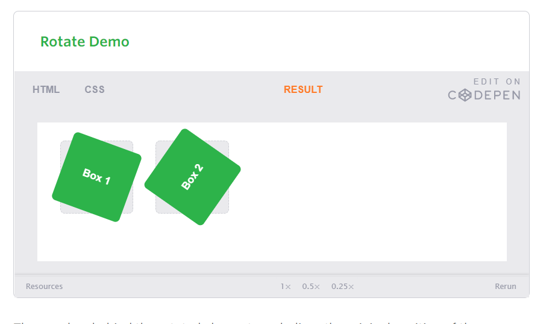

# CSS Transforms, Transitions, and Animations

## Transforms

With CSS3 came new ways to position and alter elements. Now general layout techniques can be revisited with alternative ways to size, position, and change elements. All of these new techniques are made possible by the transform property.

The transform property comes in two different settings, two-dimensional and three-dimensional. Each of these come with their own individual properties and values.

 ### Transform Syntax
The actual syntax for the transform property is quite simple, including the transform property followed by the value. The value specifies the transform type followed by a specific amount inside parentheses.

Notice how the transform property includes multiple vendor prefixes to gain the best support across all browsers. The un-prefixed declaration comes last to overwrite the prefixed versions, should a browser fully support the transform property.

In the interest of brevity, the remainder of this lesson will not include vendor prefixes. They are, however, strongly encouraged for any code in a production environment. Over time we will be able to remove these prefixes, however keeping them in is the safest approach for the time being.

### 2D Transforms#two-dimensional-transforms
Elements may be distorted, or transformed, on both a two-dimensional plane or a three-dimensional plane. Two-dimensional transforms work on the x and y axes, known as horizontal and vertical axes. Three-dimensional transforms work on both the x and y axes, as well as the z axis. These three-dimensional transforms help define not only the length and width of an element, but also the depth. We’ll start by discussing how to transform elements on a two-dimensional plane, and then work our way into three-dimensional transforms.

##### 2D Rotate
The transform property accepts a handful of different values. The rotate value provides the ability to rotate an element from 0 to 360 degrees. Using a positive value will rotate an element clockwise, and using a negative value will rotate the element counterclockwise. The default point of rotation is the center of the element, 50% 50%, both horizontally and vertically. Later we will discuss how you can change this default point of rotation.

The gray box behind the rotated element symbolizes the original position of the element. Additionally, upon hover the box will rotate 360 degrees horizontally. As the lesson progresses, keep an eye out for the gray box within each demonstration as a reference to the element’s original position and the horizontal rotation to help demonstrate an elements alteration and depth.

#### 2D Scale

Using the scale value within the transform property allows you to change the appeared size of an element. The default scale value is 1, therefore any value between .99 and .01 makes an element appear smaller while any value greater than or equal to 1.01 makes an element appear larger.

It is possible to scale only the height or width of an element using the scaleX and scaleY values. The scaleX value will scale the width of an element while the scaleY value will scale the height of an element. To scale both the height and width of an element but at different sizes, the x and y axis values may be set simultaneously. To do so, use the scale transform declaring the x axis value first, followed by a comma, and then the y axis value.

## Transitions & Animations

One evolution with CSS3 was the ability to write behaviors for transitions and animations. Front end developers have been asking for the ability to design these interactions within HTML and CSS, without the use of JavaScript or Flash, for years. Now their wish has come true.

With CSS3 transitions you have the potential to alter the appearance and behavior of an element whenever a state change occurs, such as when it is hovered over, focused on, active, or targeted.

Animations within CSS3 allow the appearance and behavior of an element to be altered in multiple keyframes. Transitions provide a change from one state to another, while animations can set multiple points of transition upon different keyframes.

### Transitions

As mentioned, for a transition to take place, an element must have a change in state, and different styles must be identified for each state. The easiest way for determining styles for different states is by using the :hover, :focus, :active, and :target pseudo-classes.

There are four transition related properties in total, including transition-property, transition-duration, transition-timing-function, and transition-delay. Not all of these are required to build a transition, with the first three are the most popular.

## 8 SIMPLE CSS3 TRANSITIONS THAT WILL WOW YOUR USERS

CSS3 has introduced countless possibilities for UX designers, and the best thing about them is that the coolest parts are really simple to implement.

Just a couple of lines of code will give you an awesome transition effect that will excite your users, increase engagement and ultimately, when used well, increase your conversions. What’s more, these effects are hardware accelerated, and a progressive enhancement that you can use right now.

Here are 8 really simple effects that will add life to your UI and smiles to your users’ faces.

All of these effects (bar one) are controlled with the transition property. So we can see these effects working, we’ll set up a div in an HTML page

### 1. Fade in
Having things fade in is a fairly common request from clients. It’s a great way to emphasize functionality or draw attention to a call to action.

Fade in effects are coded in two steps: first, you set the initial state; next, you set the change, for example on hover

### 2. Change color
Animating a change of color used to be unbelievably complex, with all kinds of math involved in calculating separate RGB values and then recombining them. Now, we just set the div’s class to “color” and specify the color we want in our CSS:

.color:hover
{
        background:#53a7ea;
}

### 3. Grow & Shrink
To grow an element, you used to have to use its width and height, or its padding. But now we can use CSS3’s transform to enlarge.

Set your div’s class to “grow” and then add this code to your style block:

### 4. Rotate elements
CSS transforms have a number of different uses, and one of the best is transforming the rotation of an element. Give your div the class “rotate” and add the following to your CSS:

### 5. Square to circle

A really popular effect at the moment is transitioning a square element into a round one, and vice versa. With CSS, it’s a simple effect to achieve, we just transition the border-radius property.

Give your div the class “circle” and add this CSS to your styles:

.circle:hover
{
        border-radius:50%;
}

### 6. 3D shadow
3D shadows were frowned upon for a year or so, because they weren’t seen as compatible with flat design, which is of course nonsense, they work fantastically well to give a user feedback on their interactions and work with flat, or fake 3D interfaces.

This effect is achieved by adding a box shadow, and then moving the element on the x axis using the transform and translate properties so that it appears to grow out of the screen.

Give your div the class “threed” and then add the following code to your CSS:

### 7. Swing

Not all elements use the transition property. We can also create highly complex animations using @keyframes, animation and animation-iteration.

In this case, we’ll first define a CSS animation in your styles. You’ll notice that due to implementation issues, we need to use @-webkit-keyframes as well as @keyframes (yes, Internet Explorer really is better than Chrome, in this respect at least).

### 8. Inset border

One of the hottest button styles right now is the ghost button; a button with no background and a heavy border. We can of course add a border to an element simply, but that will change the element’s position. We could fix that problem using box sizing, but a far simpler solution is the transition in a border using an inset box shadow.

Give your div the class “border” and add the following CSS to your styles:

.border:hover
{
        box-shadow: inset 0 0 0 25px #53a7ea;
}
